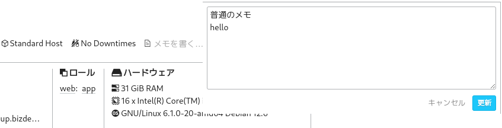

# saba-memo-runner

**saba-memo-runner**は、[Mackerel](https://ja.mackerel.io)のホストメモ情報に記載された命令を実行するスクリプトです。たとえばデモンストレーションのためにCPU負荷をかけ続けるといったフィーチャーフラグ代わりに利用できます。

## 設定

[mackerel-agent](https://mackerel.io/ja/docs/entry/howto/install-agent)を実行しているLinuxホスト上に`saba-memo-runner.sh`をコピーします。

さらに、`mkr`も[導入](https://mackerel.io/ja/docs/entry/advanced/cli)しておきます。

`saba-memo-runner.conf-tmpl`を`saba-memo-runner.conf`としてコピーし、内容を編集します。

例
```
config["echo"]="echo 'HELLO'"
config["stress"]="touch stress.lock; stress -c 2 -t 59; rm stress.lock"
```

- `config["命令名"]`で命令を定義します。命令名には英字アルファベット、数字、`_`を利用できます
- `=`の前後にスペースは入れられません
- `=`の後に実際に実行するコマンド群を指定します。これらはbashのバックグラウンドジョブとして呼び出されます。多重に実行されるのを防ぐには、「`命令名.lock`」の名前でカレントフォルダにロックファイルを置き、完了したら削除するようにしましょう

## 実行のテスト

Mackerelのホストメニューでホストを選び、メモに命令名を記入します。命令名の探索は行単位で行われ、命令名にないものは単に無視されるので、本来のメモ用途の記述と混在できます。

たとえば以下のようにメモに記述したとき、命令名として定義済みの`hello`だけが解釈されます。
```
普通のメモ
hello
```



これでsaba-memo-runnerを実行してみると、命令名helloの内容が実行されます（標準出力に`HELLO`と表示する）。

```
$ ./saba-memo-runner.sh
$ HELLO （バックグラウンド実行されたコマンド群からの標準出力・標準エラーが表示される）
```

## 定期実行をする

コマンドライン上で動作することを確認できたら、ホストメモを常時監視するためにcronあるいはsystemd-timerを設定します。

- `saba-memo-runner.sh`、`saba-memo-runner.conf`のあるフォルダに移動してからスクリプトを実行するようにします（ロックファイルもここに置かれることになります）
- 定期実行を実施するユーザー権限の強さは、何を実際に命令したいかに依存します。負荷をかける程度であれば一般ユーザーでも可能ですが、サービスを停止する、あるいはホストをシャットダウンさせるといったことを行うにはrootユーザーで実施する必要があります（※不正な命令名は無視するように配慮していますが、それでも何らかの危険性が潜んでいる可能性は否定できません）

### cronの例
`/etc/crontab`で設定する例を以下に示します。毎分、ユーザーec2-userで、ホームフォルダ下にある`saba-memo-runner`フォルダに入って実行します。

```
* * * * *       ec2-user        (cd /home/ec2-user/saba-memo-runner && ./saba-memo-runner.sh)
```

### systemd-timerの例

systemd-timerを使って呼び出すパターンです。こちらはserviceとtimerのユニットファイルを作成します。

`/etc/systemd/system/saba-memo-runner.service`
```
[Unit]
Description=Run commands using the host memo of Mackerel
After=mackerel-agent.service

[Service]
Type=oneshot
KillMode=process
User=ec2-user
WorkingDirectory=/home/ec2-user/saba-memo-runner
ExecStart=/home/ec2-user/saba-memo-runner/saba-memo-runner.sh

[Install]
WantedBy=multi-user.target
```

`/etc/systemd/system/saba-memo-runner.timer`
```
[Unit]
Description=Timer for saba-memo-runner

[Timer]
OnCalendar=minutely
Persistent=true
RandomizedDelaySec=5
FixedRandomDelay=true

[Install]
WantedBy=timers.target
```

timerユニットを登録・開始します。

```
$ sudo systemctl enable saba-memo-runner.timer
$ sudo systemctl start saba-memo-runner.timer
```

以降、unitファイルを変更したときには`daemon-reload`を実行して反映します。

```
$ sudo systemctl daemon-reload
```

### stressの実験

負荷をかけるツールのstressを導入しておき、メモに`stress`を記述し、しばらく経ったら消してみます。

負荷グラフにも示されました。


## ライセンス
```
Copyright (c) 2024 Kenshi Muto

Permission is hereby granted, free of charge, to any person obtaining a copy
of this software and associated documentation files (the "Software"), to deal
in the Software without restriction, including without limitation the rights
to use, copy, modify, merge, publish, distribute, sublicense, and/or sell
copies of the Software, and to permit persons to whom the Software is
furnished to do so, subject to the following conditions:

The above copyright notice and this permission notice shall be included in
all copies or substantial portions of the Software.

THE SOFTWARE IS PROVIDED "AS IS", WITHOUT WARRANTY OF ANY KIND, EXPRESS OR
IMPLIED, INCLUDING BUT NOT LIMITED TO THE WARRANTIES OF MERCHANTABILITY,
FITNESS FOR A PARTICULAR PURPOSE AND NONINFRINGEMENT. IN NO EVENT SHALL THE
AUTHORS OR COPYRIGHT HOLDERS BE LIABLE FOR ANY CLAIM, DAMAGES OR OTHER
LIABILITY, WHETHER IN AN ACTION OF CONTRACT, TORT OR OTHERWISE, ARISING FROM,
OUT OF OR IN CONNECTION WITH THE SOFTWARE OR THE USE OR OTHER DEALINGS IN
THE SOFTWARE.
```
